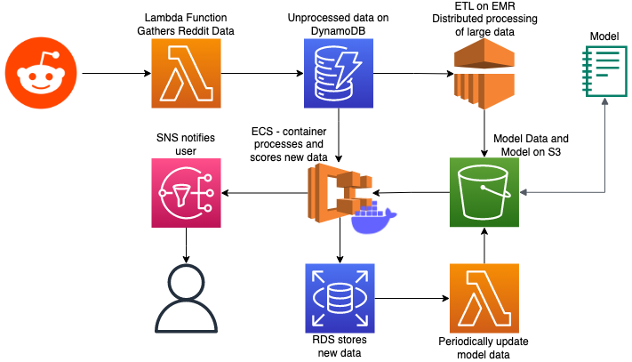
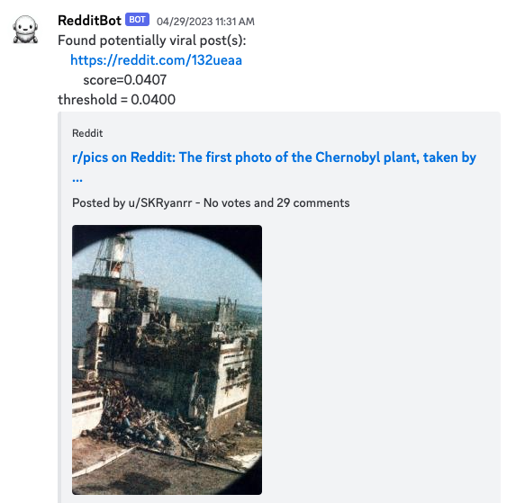

# Top Reddit Posts

## Purpose

This project intends to demonstrate a knowledge of:

1. Data Engineering and ETL - the collection and cleaning of data
2. Working within the AWS ecosystem - tools used include DynamoDB, Lambda functions, S3, RDS, EventBridge, IAM (managing permission sets, users, roles, policies, etc), ECR, and Fargate.
3. Data Science and Analysis - building out a simple model using collected data

**Make sure to read the [Wiki](https://github.com/kennethjmyers/Top-Reddit-Posts/wiki) for set-up instructions.**

### A Note on Costs

This project tries to maximize the variety of tools to use in AWS while keeping costs low, particularly on the AWS Free Tier. 

If you are on the AWS free tier, then the primary cost is the use of Fargate. Currently, while returning results for a single subreddit every 10 minutes, the cost is about $0.20/day or about $6/month. 

Keep an eye on the costs though as this project uses S3, RDS, Lambda, and other services which are free within limits but will start to incur costs if you go beyond their trial limits or continue past the trial period.

In [April 2023 Reddit announced](https://www.nytimes.com/2023/04/18/technology/reddit-ai-openai-google.html) that they would be charging for API access in the future. This did not affect this project at time of creation but could affect others in the future.

## What is this?

This project collects data from rising posts on Reddit and identifies features that predict an upcoming viral post. It then automates the prediction process via a docker container deployed on AWS Fargate and notifies the users of potentially viral posts. 

Currently the model is a GBM model and it steps up the top 3% of posts based on testing data.

### Why? 

It takes a lot of time to scroll Reddit for new and rising posts to contribute to the conversation early enough where people might see it. The "Rising" view of r/pics typically has over 250 different posts reach it per day. However, only a handful of posts make it to the front page. 

This project allows one to remove much of the time and effort in continuously searching Reddit for the next big posts, and allows one to limit comments to only posts with high probability of virality. 

### Example

Below is a sample of [the first post](https://www.reddit.com/r/pics/comments/132ueaa/the_first_photo_of_the_chernobyl_plant_taken_by/) the bot found when it was deployed. When it first sent the notification, the post had only 29 comments but it went on to garner over 57k upvotes and over 1.4k comments. 

It is easy to see how advantageous it can be to find future viral posts before they hit the front page.

### Results

When I started using the bot, my account of 12 years had 11,700 karma. After two days of testing I had grown that to >13,000 karma, an 11% increase and over 500 karma each day. User results can vary, however, as it requires continuous user monitoring for new notifications and is dependent upon the user's replies and understanding of Reddit and the subreddits' userbases.

[Plan to add monitoring results here once implemented]

## Requirements

1. python == 3.7
2. [AWS CLI v2](https://docs.aws.amazon.com/cli/latest/userguide/getting-started-install.html)

## Components

1. Check out the [Getting Started](https://github.com/kennethjmyers/Top-Reddit-Posts/wiki/Getting-Started) section of the wiki for setting up your AWS account and local environment.
2. [Lambda function](./lambdaFunctions/getRedditDataFunction/) to collect data and store in DynamoDB. See [the Wiki](https://github.com/kennethjmyers/Top-Reddit-Posts/wiki/Lambda-Function---getRedditDataFunction) for setup instructions.
3. [ETL](model/ModelETL.py), [Analysis](./model/univariateAnalysis.ipynb) and [Model creation](model/model-GBM.ipynb). 
    1. Currently EMR is not being utilized for the ETL process but the ETL process was written in pyspark so that it could scale on EMR with growing data.  
    2. DynamoDB is not really meant for bulk read and writes. As such, it is not ideal for large ETL processes. It was chosen to demonstrate knowledge in an additional datastore and because it is available to the AWS free tier. When reading data from DynamoDB to Spark, I implemented data chunking to gather multiple DynamoDB partitions before they are distributed with Spark to improve reads efficiency.
    3. Model data and Model stored on S3.
4. [Docker image](model/Dockerfile) hosted on ECR and deployed on ECS via Fargate that automates [prediction ETL process](model/PredictETL.py), stage predicted results to Postgres database on RDS and send notifications via Discord to the user.
