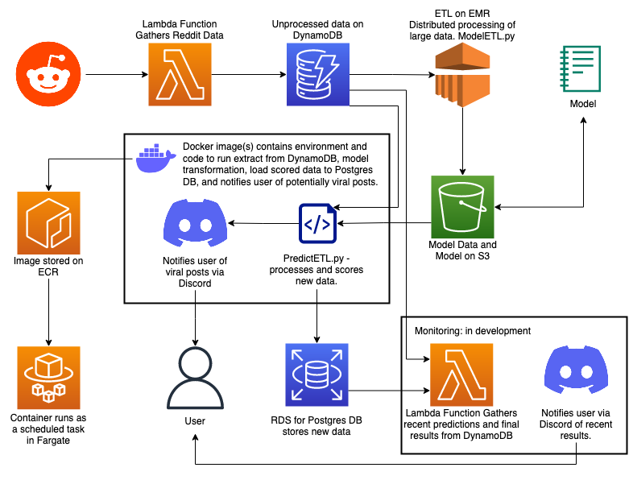

# Top Reddit Posts

## Purpose

This project intends to demonstrate a knowledge of:

1. Data Engineering and ETL - the collection and cleaning of data
2. Working within the AWS ecosystem - tools used include DynamoDB, Lambda functions, S3, RDS, EventBridge, IAM and IAM Identity Center (managing permission sets, users, roles, policies, etc)
3. Data Science and Analysis - building out a simple model using collected data

**Make sure to read the [Wiki](https://github.com/kennethjmyers/Top-Reddit-Posts/wiki) for set-up instructions.**

## What is this?

This project collects data from rising posts on Reddit and identify features that predict an upcoming viral post. Why? Consider someone who wanted to farm comment karma by getting to a viral post relatively early and voicing their input or humor. One could gather that data and notify themselves if a submission showed viral promise. I have no intention of actually using it in this way but it was the hypothetical around which I built this project. 

## Requirements

1. python == 3.7
2. [praw](https://github.com/praw-dev/praw) == 7.7.0
3. [AWS CLI v2](https://docs.aws.amazon.com/cli/latest/userguide/getting-started-install.html)
4. Spark == 3.3.0

## Components

1. Check out the [Getting Started](https://github.com/kennethjmyers/Top-Reddit-Posts/wiki/Getting-Started) section of the wiki for setting up your AWS account and local environment.
2. [Lambda function](./lambdaFunctions/getRedditDataFunction/) to collect data and store in DynamoDB. See [the Wiki](https://github.com/kennethjmyers/Top-Reddit-Posts/wiki/Lambda-Function---getRedditDataFunction) for setup instructions.
3. [ETL](model/ModelETL.py), [Analysis](./model/univariateAnalysis/univariateAnalysis.md) and [Model creation](./model/model/model.md). 
    1. Currently EMR is not being utilized for the ETL process but the ETL process was written in pyspark so that it could scale on EMR with growing data.  
    2. DynamoDB is not really meant for bulk read and writes. As such, it is not ideal for large ETL processes. It was chosen to demonstrate knowledge in an additional datastore and because it is available to the AWS free tier. When reading data from DynamoDB to Spark, I implemented data chunking to gather multiple DynamoDB partitions before they are distributed with Spark to optimize the reads.
    3. Model data and Model stored on S3.
4. Docker Container deployed on ECS that automates ETL process, stage new data to Postgres database on RDS and send notifications via SNS.
