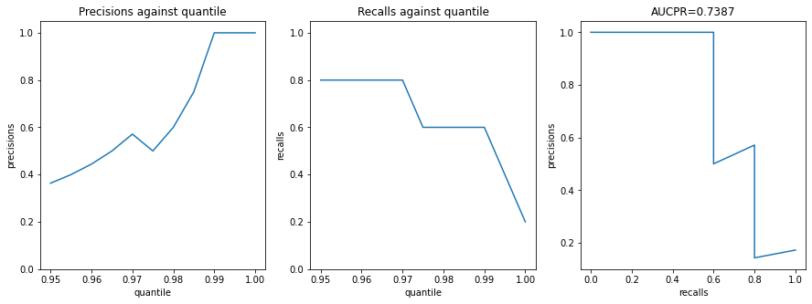
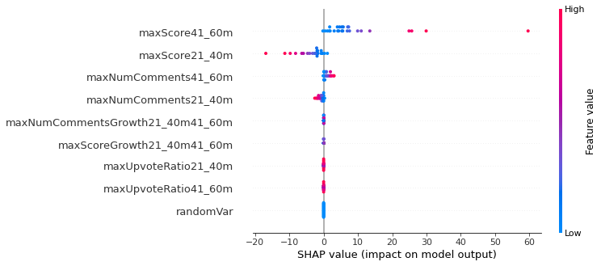
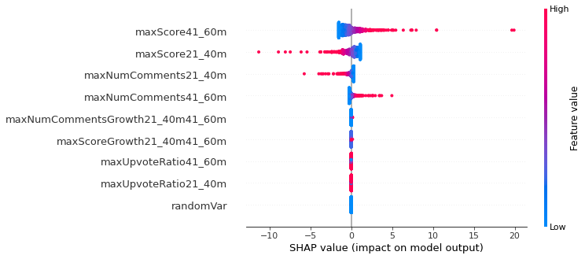
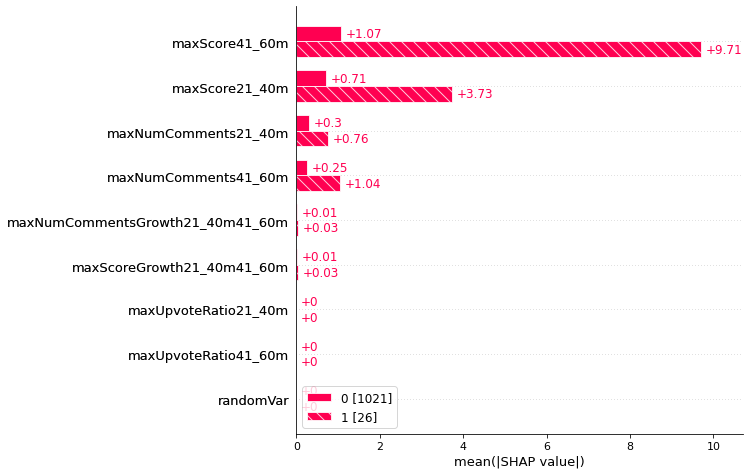
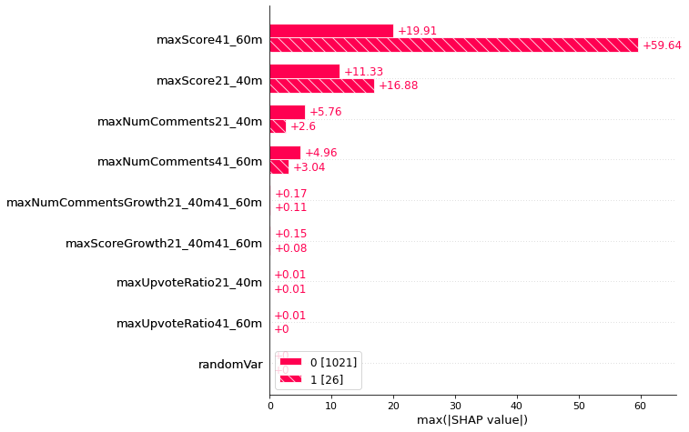

```python
%load_ext autoreload
%autoreload 2
```


```python
import utils
import s3fs
import pyarrow.parquet as pq
import matplotlib.pyplot as plt
import seaborn as sns
import numpy as np
from pyspark.sql import SparkSession
import os
import pandas as pd

os.environ['TZ'] = 'UTC'
```

# Read from S3

After the data has been collected, the dataset size is relatively small with significant reduction over scraped dataset.


```python
cfg_file = utils.findConfig()
cfg = utils.parseConfig(cfg_file)
spark = (
  SparkSession
  .builder
  .appName('redditData')
  .config('spark.driver.extraJavaOptions', '-Duser.timezone=GMT') 
  .config('spark.executor.extraJavaOptions', '-Duser.timezone=GMT')
  .config('spark.sql.session.timeZone', 'UTC')
  .config("fs.s3a.access.key", cfg['ACCESSKEY'])
  .config("fs.s3a.secret.key", cfg['SECRETKEY'])
  .getOrCreate()
)
df = spark.read.parquet('s3a://data-kennethmyers/redditAggregatedData.parquet').toPandas()
spark.stop()  # we don't need spark now
```

# Model


```python
from sklearn.linear_model import LogisticRegression
from sklearn.model_selection import StratifiedShuffleSplit
from sklearn.metrics import accuracy_score, recall_score, precision_score, precision_recall_curve, auc
from sklearn.preprocessing import StandardScaler
```


```python
df = df.fillna(0)
```


```python
# adding a random variable, I like to see how it performs against other variables
df['randomVar'] = np.random.binomial(1, df['target'].mean(), len(df))
```


```python
def plotPrecRecAUCPR(X_train, y_train, X_test, y_test):
  lr = LogisticRegression(penalty='l2', fit_intercept=True, C=.01)
  lr.fit(X_train, y_train)
  y_pred = lr.predict(X_test)
  y_pred_proba = lr.predict_proba(X_test)[:, 1]
  # print(f"accuracy: {accuracy_score(y_test,y_pred)}") # doesn't mean much with imbalanced data
  # print(f"precision: {precision_score(y_test,y_pred)}")
  # print(f"recall: {recall_score(y_test,y_pred)}")
  precisions, recalls, thresholds = precision_recall_curve(y_test, y_pred_proba)
  aucpr = auc(recalls, precisions)
  print(f"AUCPR: {aucpr:.04f}")

  coefFeatures = np.concatenate((lr.feature_names_in_,np.array(['intercept'])))
  coefValues = np.concatenate((lr.coef_[0],lr.intercept_))
  coefDf = pd.DataFrame(list(zip(coefFeatures, coefValues)), columns=['feature', 'coef'])
  coefDf['coefPct'] = (np.abs(coefDf['coef'])/np.abs(coefDf['coef']).sum()).apply(lambda x: f"{x:.06f}")
  print(coefDf.to_string())

  topQuantiles = np.arange(.95,1,0.005)
  topQuantilesThresholds = np.quantile(y_pred_proba, topQuantiles)
  totalTargets = y_test.sum()
  topQPrecisions = [y_test[y_pred_proba>=t].mean() for t in topQuantilesThresholds]
  topQRecalls = [y_test[y_pred_proba>=t].sum()/totalTargets for t in topQuantilesThresholds]

  fig, axes = plt.subplots(1, 3, figsize=(15, 5), sharey=False, squeeze=False)

  axes[0,0].plot(topQuantiles, topQPrecisions)
  axes[0,0].set_title(f'Precisions against quantile')
  axes[0,0].set_ylim([0,1.05])
  axes[0,0].set_xlabel('quantile')
  axes[0,0].set_ylabel('precisions')

  axes[0,1].plot(topQuantiles, topQRecalls)
  axes[0,1].set_title(f'Recalls against quantile')
  axes[0,1].set_ylim([0,1.05])
  axes[0,1].set_xlabel('quantile')
  axes[0,1].set_ylabel('recalls')

  axes[0,2].plot(recalls, precisions)
  axes[0,2].set_title(f'AUCPR={aucpr:.04f}')
  axes[0,2].set_xlabel('recalls')
  axes[0,2].set_ylabel('precisions')

  plt.show()
```


```python
# scaler = StandardScaler()
# scaler.fit(X_train)
# X_train_std, X_test_std = pd.DataFrame(scaler.transform(X_train), columns=X_train.columns), scaler.transform(X_test)
 
features = [
  #'maxScore20m',
  'maxScore21_40m',
  'maxScore41_60m',
  #'maxNumComments20m',
  'maxNumComments21_40m',
  'maxNumComments41_60m',
#   'maxUpvoteRatio20m', 
  'maxUpvoteRatio21_40m',
  'maxUpvoteRatio41_60m',
#   'maxNumGildings20m',  # we know these are bad features from prior analysis
#   'maxNumGildings21_40m',
#   'maxNumGildings41_60m',
  'maxScoreGrowth21_40m41_60m',
  'maxNumCommentsGrowth21_40m41_60m',
  'randomVar',
]

X = df[features]
y = df['target']
print(f"total posts: {len(y)}, viral posts: {y.sum()}")  # how many targets are there, This is a highly imbalanced problem, only ~2.5% of posts in rising go viral

sss = StratifiedShuffleSplit(n_splits=1, train_size=0.8, test_size=0.2, random_state=0)
train_index, test_index = next(sss.split(X,y))
X_train, y_train, X_test, y_test = X.iloc[train_index], y.iloc[train_index], X.iloc[test_index], y.iloc[test_index]

plotPrecRecAUCPR(X_train, y_train, X_test, y_test)
```

    total posts: 1047, viral posts: 26
    AUCPR: 0.7387
                                feature      coef   coefPct
    0                    maxScore21_40m -0.102552  0.019093
    1                    maxScore41_60m  0.122840  0.022870
    2              maxNumComments21_40m -0.124421  0.023165
    3              maxNumComments41_60m  0.048460  0.009022
    4              maxUpvoteRatio21_40m  0.010928  0.002035
    5              maxUpvoteRatio41_60m  0.009428  0.001755
    6        maxScoreGrowth21_40m41_60m  0.038466  0.007162
    7  maxNumCommentsGrowth21_40m41_60m  0.061712  0.011490
    8                         randomVar -0.001982  0.000369
    9                         intercept -4.850372  0.903040





This is a pretty good model so far. There seems to be evidence for removing the upvote ratio features. I ran an experiment without them (not shown here) and it seemed to perform well without them but I want to experiment more before making a decision.


```python
# sorted top 10 predictions
sorted(list(zip(y_pred_proba, y_test)), key=lambda x:x[0])[::-1][:10]
```


    [(0.06020266659787673, 0),
     (0.05240396880412406, 0),
     (0.04298745870651433, 0),
     (0.039768110456671474, 0),
     (0.03874993953016156, 0),
     (0.037285632209419654, 0),
     (0.03566623960759841, 0),
     (0.03525635766580686, 0),
     (0.035088343739840225, 0),
     (0.03348198975346211, 0)]


It is cool to see many of the posts being scored at the top.


```python
# I wanted to see some data on the viral posts (why were some accurately predicted and some not)
# and the posts that had high viral probability but were considered non-viral
def getOriginalPostId():
  fullTestData = df.iloc[test_index].copy(deep=True)
  fullTestData['prediction'] = y_pred_proba
  fullTestData['link'] = fullTestData['postId'].apply(lambda x: "https://reddit.com/"+x)
  target1Indexes = np.where(y_test==1)[0]
  viralPosts = fullTestData[fullTestData['target']==1].sort_values('prediction', ascending=False)
  nonViralPosts = fullTestData[fullTestData['target']==0].sort_values('prediction', ascending=False).head(3)
  return pd.concat([viralPosts, nonViralPosts], axis=0)[['target', 'postId', 'link', 'prediction', 'createdTSUTC']+features]


getOriginalPostId()
```


<div>
<style scoped>
    .dataframe tbody tr th:only-of-type {
        vertical-align: middle;
    }

    .dataframe tbody tr th {
        vertical-align: top;
    }

    .dataframe thead th {
        text-align: right;
    }
</style>
<table border="1" class="dataframe">
  <thead>
    <tr style="text-align: right;">
      <th></th>
      <th>target</th>
      <th>postId</th>
      <th>link</th>
      <th>prediction</th>
      <th>createdTSUTC</th>
      <th>maxScore20m</th>
      <th>maxScore21_40m</th>
      <th>maxScore41_60m</th>
      <th>maxNumComments20m</th>
      <th>maxNumComments21_40m</th>
      <th>maxNumComments41_60m</th>
      <th>maxUpvoteRatio21_40m</th>
      <th>maxUpvoteRatio41_60m</th>
      <th>randomVar</th>
    </tr>
  </thead>
  <tbody>
    <tr>
      <th>74</th>
      <td>1</td>
      <td>12iolqv</td>
      <td>https://reddit.com/12iolqv</td>
      <td>0.113352</td>
      <td>2023-04-11 16:07:21</td>
      <td>10.0</td>
      <td>29.0</td>
      <td>67.0</td>
      <td>1.0</td>
      <td>6.0</td>
      <td>9.0</td>
      <td>0.95</td>
      <td>0.94</td>
      <td>0</td>
    </tr>
    <tr>
      <th>125</th>
      <td>1</td>
      <td>12k617g</td>
      <td>https://reddit.com/12k617g</td>
      <td>0.093240</td>
      <td>2023-04-13 00:48:33</td>
      <td>27.0</td>
      <td>43.0</td>
      <td>54.0</td>
      <td>3.0</td>
      <td>9.0</td>
      <td>11.0</td>
      <td>0.94</td>
      <td>0.86</td>
      <td>0</td>
    </tr>
    <tr>
      <th>839</th>
      <td>1</td>
      <td>12jijwn</td>
      <td>https://reddit.com/12jijwn</td>
      <td>0.074497</td>
      <td>2023-04-12 11:07:02</td>
      <td>9.0</td>
      <td>25.0</td>
      <td>52.0</td>
      <td>4.0</td>
      <td>6.0</td>
      <td>16.0</td>
      <td>0.88</td>
      <td>0.87</td>
      <td>0</td>
    </tr>
    <tr>
      <th>246</th>
      <td>1</td>
      <td>12j3thv</td>
      <td>https://reddit.com/12j3thv</td>
      <td>0.025383</td>
      <td>2023-04-12 00:36:43</td>
      <td>9.0</td>
      <td>14.0</td>
      <td>24.0</td>
      <td>0.0</td>
      <td>2.0</td>
      <td>3.0</td>
      <td>1.00</td>
      <td>1.00</td>
      <td>0</td>
    </tr>
    <tr>
      <th>607</th>
      <td>1</td>
      <td>12jhdpf</td>
      <td>https://reddit.com/12jhdpf</td>
      <td>0.015046</td>
      <td>2023-04-12 10:14:37</td>
      <td>3.0</td>
      <td>7.0</td>
      <td>10.0</td>
      <td>1.0</td>
      <td>2.0</td>
      <td>3.0</td>
      <td>0.82</td>
      <td>0.82</td>
      <td>0</td>
    </tr>
    <tr>
      <th>297</th>
      <td>0</td>
      <td>12jj0ew</td>
      <td>https://reddit.com/12jj0ew</td>
      <td>0.068621</td>
      <td>2023-04-12 11:25:56</td>
      <td>20.0</td>
      <td>26.0</td>
      <td>50.0</td>
      <td>2.0</td>
      <td>4.0</td>
      <td>9.0</td>
      <td>0.96</td>
      <td>0.90</td>
      <td>0</td>
    </tr>
    <tr>
      <th>43</th>
      <td>0</td>
      <td>12h08ll</td>
      <td>https://reddit.com/12h08ll</td>
      <td>0.056007</td>
      <td>2023-04-09 23:49:41</td>
      <td>17.0</td>
      <td>29.0</td>
      <td>44.0</td>
      <td>4.0</td>
      <td>4.0</td>
      <td>4.0</td>
      <td>0.95</td>
      <td>0.91</td>
      <td>0</td>
    </tr>
    <tr>
      <th>23</th>
      <td>0</td>
      <td>12i33t8</td>
      <td>https://reddit.com/12i33t8</td>
      <td>0.050293</td>
      <td>2023-04-11 01:03:09</td>
      <td>19.0</td>
      <td>34.0</td>
      <td>40.0</td>
      <td>0.0</td>
      <td>1.0</td>
      <td>1.0</td>
      <td>0.97</td>
      <td>0.97</td>
      <td>0</td>
    </tr>
  </tbody>
</table>
</div>


I created the above to spotcheck a few examples. The 2 that I failed to predict were both pretty viral (exceeding two I succeeded in predicting) despite having relatively weak metrics (3 comments after an hour, <25 upvotes after an hour). This shows that there is pretty good lag in posts going viral and that perhaps more than an hour is needed to accurately predict virality. Another thing I noticed was that those two posts were both about tragedies, so perhaps there there is something about tragedies going extremely viral but are slower to gain traction.

The three posts that were predicted to go viral but ultimately were not all had pretty high upvote counts after the first hour but must have lost traction afterwards, this is further evidence that maybe it would be better to extend the data collection another 30-60 minutes.

# SHAP analysis

For imbalanced datasets, I like to look at the SHAP values for the target of interest (viral posts).


```python
import shap
```


```python
# https://shap.readthedocs.io/en/latest/example_notebooks/api_examples/plots/beeswarm.html
lr = LogisticRegression(penalty='l2', fit_intercept=True, C=.01)
lr.fit(X, y)
explainer = shap.Explainer(lr, X, feature_names=X.columns)
shap_values = explainer(X)
shap_values_0 = explainer(X[y==0])
shap_values_1 = explainer(X[y==1])

shap.plots.beeswarm(shap_values_1, show=False)
ax = plt.gca()
# You can change the min and max value of xaxis by changing the arguments of:
#ax.set_xlim(-3, 3) 
plt.show()
```





```python
shap.plots.beeswarm(shap_values_0, show=False)
ax = plt.gca()
# You can change the min and max value of xaxis by changing the arguments of:
#ax.set_xlim(-3, 3) 
plt.show()
```





```python
shap.plots.bar(shap_values.cohorts([i for i in map(str, y.values)]).abs.mean(0), show=False)
```





```python
shap.plots.bar(shap_values.cohorts([i for i in map(str, y.values)]).abs.max(0), show=False)

```





# Grid search regularization parameter

Here I'm removing features based on the above findings, then I want to check how the model performs on different splits.

I'm removing the randomVar and the upvoteRatio features since they seem to be the least useful.


```python
from collections import defaultdict

C_values = [1, 0.5, 0.25, 0.1, 0.01, 0.001, 0.0001, 0.00001]

features = [
  #'maxScore20m',
  'maxScore21_40m',
  'maxScore41_60m',
  #'maxNumComments20m',
  'maxNumComments21_40m',
  'maxNumComments41_60m',
#   'maxUpvoteRatio20m', 
#   'maxUpvoteRatio21_40m',
#   'maxUpvoteRatio41_60m',
#   'maxNumGildings20m',  # we know these are bad features from prior analysis
#   'maxNumGildings21_40m',
#   'maxNumGildings41_60m',
  'maxScoreGrowth21_40m41_60m',
  'maxNumCommentsGrowth21_40m41_60m',
#   'randomVar',
]

X = df[features]
y = df['target']
print(f"total posts: {len(y)}, viral posts: {y.sum()}")  # how many targets are there, This is a highly imbalanced problem, only ~2.5% of posts in rising go viral

sss = StratifiedShuffleSplit(n_splits=10, train_size=0.8, test_size=0.2, random_state=0)

aucprs = defaultdict(list)
top2PctPrecisions = defaultdict(list)
top2PctRecalls = defaultdict(list)

for c in C_values:
  print(f'collecting data for C={c}')
  for i, (train_index, test_index) in enumerate(sss.split(X,y)):
    X_train, y_train, X_test, y_test = X.iloc[train_index], y.iloc[train_index], X.iloc[test_index], y.iloc[test_index]
    lr = LogisticRegression(penalty='l2', fit_intercept=True, C=c, max_iter=1000)
    lr.fit(X_train, y_train)
    y_pred = lr.predict(X_test)
    y_pred_proba = lr.predict_proba(X_test)[:, 1]
    precisions, recalls, thresholds = precision_recall_curve(y_test, y_pred_proba)
  #   topQuantiles = np.arange(.95,1,0.005)
    top2PctThreshold2 = np.quantile(y_pred_proba, 0.98)
    totalTargets = y_test.sum()
    top2PctPrecision = y_test[y_pred_proba>=top2PctThreshold2].mean()
    top2PctRecall = y_test[y_pred_proba>=top2PctThreshold2].sum()/totalTargets
    aucpr = auc(recalls, precisions)
    aucprs[c].append(aucpr)
    top2PctPrecisions[c].append(top2PctPrecision)
    top2PctRecalls[c].append(top2PctRecall)
  
  
  
dfDict = {
  'C':C_values,
  'AUCPRmean':[],
  'AUCPRstd':[],
  'top2PctPrecisionmean':[],
  'top2PctPrecisionstd':[],
  'top2PctRecallmean':[],
  'top2PctRecallstd':[],
}
for c in C_values:
  dfDict['AUCPRmean'].append(np.mean(aucprs[c]))
  dfDict['AUCPRstd'].append(np.std(aucprs[c]))
  dfDict['top2PctPrecisionmean'].append(np.mean(top2PctPrecisions[c]))
  dfDict['top2PctPrecisionstd'].append(np.std(top2PctPrecisions[c]))
  dfDict['top2PctRecallmean'].append(np.mean(top2PctRecalls[c]))
  dfDict['top2PctRecallstd'].append(np.std(top2PctRecalls[c]))

display(pd.DataFrame(dfDict))
```

    total posts: 1047, viral posts: 26
    collecting data for C=1
    collecting data for C=0.5
    collecting data for C=0.25
    collecting data for C=0.1
    collecting data for C=0.01
    collecting data for C=0.001
    collecting data for C=0.0001
    collecting data for C=1e-05


<div>
<style scoped>
    .dataframe tbody tr th:only-of-type {
        vertical-align: middle;
    }

    .dataframe tbody tr th {
        vertical-align: top;
    }

    .dataframe thead th {
        text-align: right;
    }
</style>
<table border="1" class="dataframe">
  <thead>
    <tr style="text-align: right;">
      <th></th>
      <th>C</th>
      <th>AUCPRmean</th>
      <th>AUCPRstd</th>
      <th>top2PctPrecisionmean</th>
      <th>top2PctPrecisionstd</th>
      <th>top2PctRecallmean</th>
      <th>top2PctRecallstd</th>
    </tr>
  </thead>
  <tbody>
    <tr>
      <th>0</th>
      <td>1.00000</td>
      <td>0.694865</td>
      <td>0.199995</td>
      <td>0.68</td>
      <td>0.183303</td>
      <td>0.68</td>
      <td>0.183303</td>
    </tr>
    <tr>
      <th>1</th>
      <td>0.50000</td>
      <td>0.698700</td>
      <td>0.203529</td>
      <td>0.68</td>
      <td>0.183303</td>
      <td>0.68</td>
      <td>0.183303</td>
    </tr>
    <tr>
      <th>2</th>
      <td>0.25000</td>
      <td>0.696974</td>
      <td>0.205991</td>
      <td>0.68</td>
      <td>0.203961</td>
      <td>0.68</td>
      <td>0.203961</td>
    </tr>
    <tr>
      <th>3</th>
      <td>0.10000</td>
      <td>0.712858</td>
      <td>0.220093</td>
      <td>0.68</td>
      <td>0.203961</td>
      <td>0.68</td>
      <td>0.203961</td>
    </tr>
    <tr>
      <th>4</th>
      <td>0.01000</td>
      <td>0.709550</td>
      <td>0.213872</td>
      <td>0.68</td>
      <td>0.183303</td>
      <td>0.68</td>
      <td>0.183303</td>
    </tr>
    <tr>
      <th>5</th>
      <td>0.00100</td>
      <td>0.616284</td>
      <td>0.206839</td>
      <td>0.60</td>
      <td>0.200000</td>
      <td>0.60</td>
      <td>0.200000</td>
    </tr>
    <tr>
      <th>6</th>
      <td>0.00010</td>
      <td>0.521266</td>
      <td>0.215960</td>
      <td>0.56</td>
      <td>0.195959</td>
      <td>0.56</td>
      <td>0.195959</td>
    </tr>
    <tr>
      <th>7</th>
      <td>0.00001</td>
      <td>0.519571</td>
      <td>0.218600</td>
      <td>0.56</td>
      <td>0.195959</td>
      <td>0.56</td>
      <td>0.195959</td>
    </tr>
  </tbody>
</table>
</div>


Based on this it seems that more regularization has diminishing returns near the area where I was planning to choose my cutoff. I'll probably settle on a regularizer of C~0.01

# Create Final Model and Save Model

Final model is just going to use all of the data. This isn't typical practice but we don't have a lot of data so I want to use all of the data available. 


```python
features = [
  #'maxScore20m',
  'maxScore21_40m',
  'maxScore41_60m',
  #'maxNumComments20m',
  'maxNumComments21_40m',
  'maxNumComments41_60m',
#   'maxUpvoteRatio20m', 
#   'maxUpvoteRatio21_40m',
#   'maxUpvoteRatio41_60m',
#   'maxNumGildings20m',  # we know these are bad features from prior analysis
#   'maxNumGildings21_40m',
#   'maxNumGildings41_60m',
  'maxScoreGrowth21_40m41_60m',
  'maxNumCommentsGrowth21_40m41_60m',
#   'randomVar',
]

X = df[features]
y = df['target']
print(f"total posts: {len(y)}, viral posts: {y.sum()}")  # how many targets are there, This is a highly imbalanced problem, only ~2.5% of posts in rising go viral

lr = LogisticRegression(penalty='l2', fit_intercept=True, C=c, max_iter=1000)
lr.fit(X, y)

```

    total posts: 1047, viral posts: 26


    LogisticRegression(C=1e-05, max_iter=1000)


```python
import pickle
from datetime import datetime

now = datetime.utcnow().strftime('%Y%m%d-%H%M%S')
filename = f'./pickledModels/Reddit_LR_model_{now}.sav'
pickle.dump(lr, open(filename, 'wb'))
```


```python
# testing the model
loaded_model = pickle.load(open(filename, 'rb'))
result = loaded_model.predict_proba(X)
print(result)
```

    [[0.97706597 0.02293403]
     [0.97557526 0.02442474]
     [0.98022698 0.01977302]
     ...
     [0.97917265 0.02082735]
     [0.98128941 0.01871059]
     [0.97975689 0.02024311]]


Next step is to move the model to S3, see the scripts directory for `copyToS3.sh` script. 


```python

```
