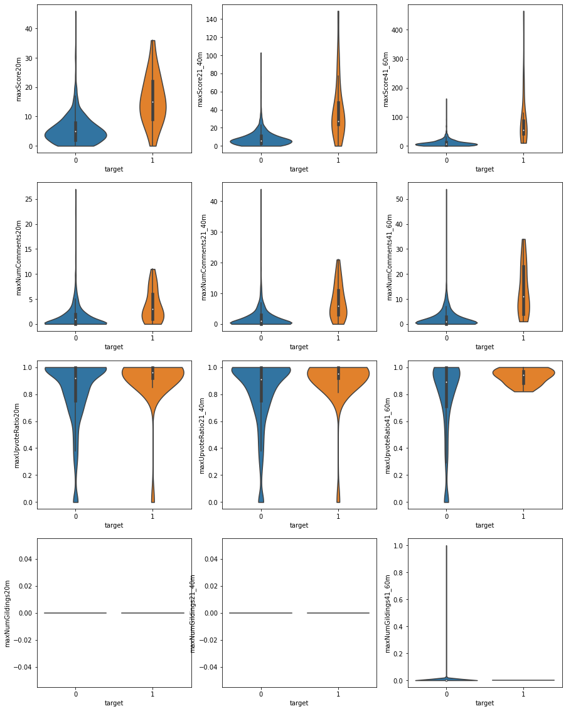
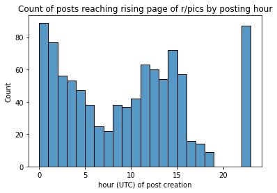
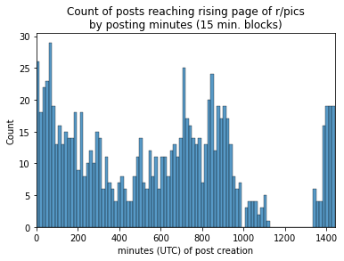
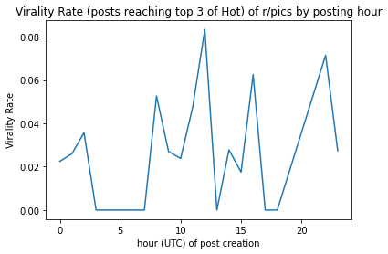

Before rerunning this analysis, make a copy of this file. 


```python
%load_ext autoreload
%autoreload 2
```


```python
import utils
import s3fs
import pyarrow.parquet as pq
import matplotlib.pyplot as plt
import seaborn as sns
import numpy as np
from pyspark.sql import SparkSession
import os

os.environ['TZ'] = 'UTC'
```

# Read from S3

After the data has been collected, the dataset size is relatively small with significant reduction over scraped dataset.


```python
cfg_file = utils.findConfig()
cfg = utils.parseConfig(cfg_file)
spark = (
  SparkSession
  .builder
  .appName('redditData')
  .config('spark.driver.extraJavaOptions', '-Duser.timezone=GMT') 
  .config('spark.executor.extraJavaOptions', '-Duser.timezone=GMT')
  .config('spark.sql.session.timeZone', 'UTC')
  .config("fs.s3a.access.key", cfg['ACCESSKEY'])
  .config("fs.s3a.secret.key", cfg['SECRETKEY'])
  .getOrCreate()
)
df = spark.read.parquet('s3a://data-kennethmyers/redditAggregatedData.parquet').toPandas()
```

# Distributions


```python
df = df.fillna(0)

featureColumns = df.columns[4:-1]
featureColumns = np.array(featureColumns).reshape(4,3)

fig, axes = plt.subplots(4, 3, figsize=(15, 20), sharey=False)

for i,row in enumerate(featureColumns):
  for j,col in enumerate(row):
    sns.violinplot(data = df, x='target', y=col, ax=axes[i,j], cut=0)
    
plt.show()
```





- It looks like the maxScore could be one of the best features.
- numComments could also be predictive, looks like there is good mean separation, although the extremes of non-viral have high comment counts.
- maxUpvotedRatio is at later times seems like it could be predictive but not at the lower end.
- numGildings will probably be one of the weakest, it's generally constant (0).

# Describe features


```python
for col in df.columns[4:-1]:
  print(col)
  subdf = df[[col, 'target']].groupby('target').describe()
  print(subdf.reset_index(drop=False).to_string())
  print()
```

    maxScore20m
      target maxScore20m                                                 
                   count       mean       std  min  25%   50%   75%   max
    0      0       931.0   5.622986  4.879480  0.0  2.0   5.0   8.0  46.0
    1      1        25.0  15.800000  8.519585  0.0  9.0  15.0  22.0  36.0
    
    maxScore21_40m
      target maxScore21_40m                                                    
                      count       mean        std  min   25%   50%   75%    max
    0      0          931.0   8.254565   8.546562  0.0   3.0   6.0  11.0  103.0
    1      1           25.0  40.120000  33.870243  0.0  24.0  27.0  48.0  149.0
    
    maxScore41_60m
      target maxScore41_60m                                                     
                      count       mean        std   min   25%   50%   75%    max
    0      0          931.0  10.307197  11.912050   0.0   3.0   8.0  14.0  163.0
    1      1           25.0  87.720000  98.696724  10.0  42.0  54.0  87.0  465.0
    
    maxNumComments20m
      target maxNumComments20m                                              
                         count      mean       std  min  25%  50%  75%   max
    0      0             931.0  1.411386  2.329668  0.0  0.0  1.0  2.0  27.0
    1      1              25.0  3.680000  3.223869  0.0  1.0  3.0  6.0  11.0
    
    maxNumComments21_40m
      target maxNumComments21_40m                                               
                            count      mean       std  min  25%  50%   75%   max
    0      0                931.0  2.066595  3.455379  0.0  0.0  1.0   3.0  44.0
    1      1                 25.0  7.480000  5.803160  0.0  3.0  6.0  11.0  21.0
    
    maxNumComments41_60m
      target maxNumComments41_60m                                                  
                            count       mean        std  min  25%   50%   75%   max
    0      0                931.0   2.508056   4.339948  0.0  0.0   1.0   3.0  54.0
    1      1                 25.0  13.520000  10.029623  1.0  4.0  11.0  23.0  34.0
    
    maxUpvoteRatio20m
      target maxUpvoteRatio20m                                               
                         count      mean       std  min   25%   50%  75%  max
    0      0             931.0  0.828711  0.245871  0.0  0.75  0.92  1.0  1.0
    1      1              25.0  0.919200  0.197672  0.0  0.92  0.96  1.0  1.0
    
    maxUpvoteRatio21_40m
      target maxUpvoteRatio21_40m                                               
                            count      mean       std  min   25%   50%  75%  max
    0      0                931.0  0.818174  0.252619  0.0  0.75  0.91  1.0  1.0
    1      1                 25.0  0.909600  0.197347  0.0  0.92  0.95  1.0  1.0
    
    maxUpvoteRatio41_60m
      target maxUpvoteRatio41_60m                                                 
                            count      mean       std   min   25%   50%   75%  max
    0      0                931.0  0.775618  0.287445  0.00  0.71  0.89  1.00  1.0
    1      1                 25.0  0.932000  0.057373  0.82  0.88  0.94  0.97  1.0
    
    maxNumGildings20m
      target maxNumGildings20m                                   
                         count mean  std  min  25%  50%  75%  max
    0      0             931.0  0.0  0.0  0.0  0.0  0.0  0.0  0.0
    1      1              25.0  0.0  0.0  0.0  0.0  0.0  0.0  0.0
    
    maxNumGildings21_40m
      target maxNumGildings21_40m                                   
                            count mean  std  min  25%  50%  75%  max
    0      0                931.0  0.0  0.0  0.0  0.0  0.0  0.0  0.0
    1      1                 25.0  0.0  0.0  0.0  0.0  0.0  0.0  0.0
    
    maxNumGildings41_60m
      target maxNumGildings41_60m                                             
                            count      mean       std  min  25%  50%  75%  max
    0      0                931.0  0.001074  0.032774  0.0  0.0  0.0  0.0  1.0
    1      1                 25.0  0.000000  0.000000  0.0  0.0  0.0  0.0  0.0
    


# Hour of Day

Although post count is low right now, what does hour of day look like for virality


```python
sns.histplot(df['createdTSUTC'].apply(lambda x: x.hour), binwidth=1)
plt.xlabel('hour (UTC) of post creation')
plt.title('Count of posts reaching rising page of r/pics by posting hour')
plt.show()
```





```python
# this is just a higher resolution of the above plot, you can change the bin with to however many minutes
blockSize = 15
sns.histplot(df['createdTSUTC'].apply(lambda x: x.hour*60+x.minute), binwidth=blockSize)
plt.xlim(0,60*24)
plt.xlabel('minutes (UTC) of post creation')
plt.title(f'Count of posts reaching rising page of r/pics\nby posting minutes ({blockSize} min. blocks)')
plt.show()
```





```python
df['hour'] = df['createdTSUTC'].apply(lambda x: x.hour)
viralityByHour = df[['hour', 'target']].groupby('hour').mean().reset_index(drop=False)
x = viralityByHour['hour']
y = viralityByHour['target']
plt.plot(x,y)
plt.xlabel('hour (UTC) of post creation')
plt.title('Virality Rate (posts reaching top 3 of Hot) of r/pics by posting hour')
plt.ylabel('Virality Rate')
plt.show()
```





These insights are really fascinating so far but would probably warrant a second glance when more data is available. We can see that posts never even make it to rising if posted around 3-6pm EST. My guess is that there is such an influx of content from kids getting out of school and people getting off of work that nothing posted in this region makes it to rising. As such, it could be good to have encode a flag designating these hours. 

It's also interesting to see that right now 8% of posts made at 8am go viral, with some other peaks at about 12pm and 6pm. This is still very noisy and I think more data needs to be collected before we can draw anything conclusive about these hours.
